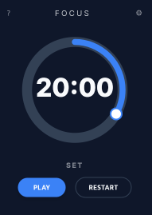

# FocusTimer

A cross platform timer that helps you focus on your tasks.

## Roadmap

1. Add option to display completion message after the task is completed.
   - In a window or full-screen
   - On main screen or all screens
1. Ability to choose from several sounds.

## Development

### Building

Instructions for building and deploying your app:

#### Building for Linux

To create a production-ready package for Linux, run: `npm run tauri build`

- **Output**: By default, this will generate a `.deb` package and an `AppImage` in `src-tauri/target/release/bundle/`.
- **Prerequisites**: You'll need standard development libraries like `libwebkit2gtk-4.1-dev` and `build-essential`.

#### Building for Android

Tauri 2.0 supports Android natively. Follow these steps:

1. Initialize Android Project:

   `npm run tauri android init`

   This will set up the necessary Android Studio project structure.

1. Build the APK/Bundle:

   `npm run tauri android build`

   **Output**: This generates an .apk or .aab file for deployment.

   **Prerequisites**: You must have the Android SDK, NDK, and Android Studio installed and configured on your machine.

   **Note**: System tray logic has been wrapped in a "desktop-only" block (`#[cfg(desktop)]`), so the app will compile perfectly for Android without trying to use desktop-only features like the system tray.

1. Deploying to Android (Dev Mode)

   If you want to test the app directly on a connected Android device or emulator:

   `npm run tauri android dev`
